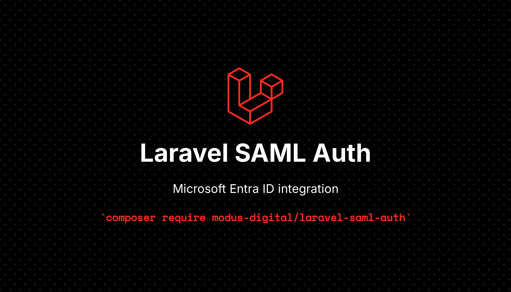

# Laravel SAML Auth

[](https://packagist.org/packages/modus-digital/laravel-saml-auth)
[](https://github.com/modus-digital/laravel-saml-auth/actions?query=workflow%3Arun-tests+branch%3Amain)
[](https://github.com/modus-digital/laravel-saml-auth/actions?query=workflow%3A"Fix+PHP+code+style+issues"+branch%3Amain)
[](https://packagist.org/packages/modus-digital/laravel-saml-auth)



This is where your description should go. Limit it to a paragraph or two. Consider adding a small example.

## Installation

You can install the package via composer:

```bash
composer require modus-digital/laravel-saml-auth
```


You can publish the config file with:

```bash
php artisan vendor:publish --tag="laravel-saml-auth-config"
```

## Testing

```bash
composer test
```

## Changelog

Please see [CHANGELOG](CHANGELOG.md) for more information on what has changed recently.

## Contributing

Please see [CONTRIBUTING](CONTRIBUTING.md) for details.

## Security Vulnerabilities

Please review [our security policy](../../security/policy) on how to report security vulnerabilities.

## Credits

- [Alex van Steenhoven](https://github.com/AlexVanSteenhoven)
- [All Contributors](../../contributors)

## License

The MIT License (MIT). Please see [License File](LICENSE.md) for more information.
